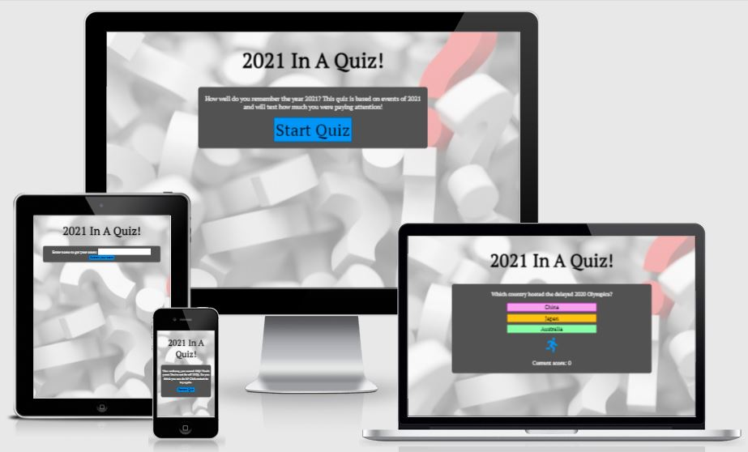
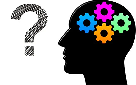

# **2021 In A Quiz**
## **Aim of the site**
The aim of the site is to quiz players on events that happened in 2021. I have four categories of questions: sports, general knowledge, tv & film and music. 2021 Was another difficult year for many due to coronavirus so I've avoided any questions linked to the pandemic.

## **Features**

### **Colour Scheme and Font**

The colour scheme I chose was inspired by an image that I was initially going to use as my hero image in the early design of the website. The image is attached below.

It feature a side on view of a head with four cogs for a brain inside and a large question mark. I have used colours similar to the cogs for the answer buttons and the catergory icon. For the background I wanted an image that wasn't too distracting. I found an image of question marks that I was able to change the opacity of online so it wasn't too overpowering.