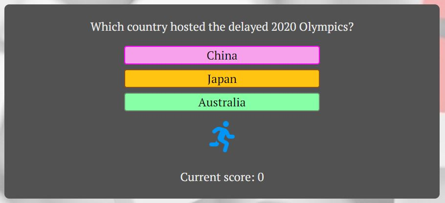
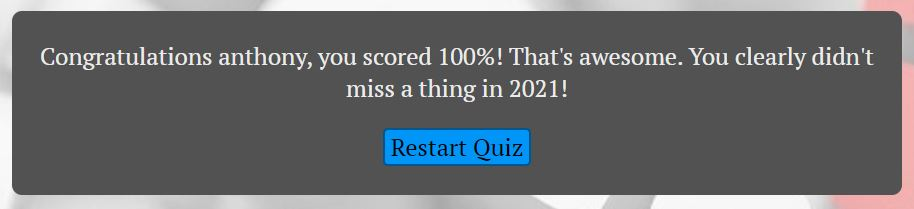

# **2021 In A Quiz**
## **Aim of the site**
The aim of the site is to quiz players on events that happened in 2021. I have four categories of questions: sports, general knowledge, tv & film and music. 2021 Was another difficult year for many due to coronavirus so I've avoided any questions linked to the pandemic.

## **Features**

### **Colour Scheme and Font**

The colour scheme I chose was inspired by an image that I was initially going to use as my hero image in the early design of the website. The image is attached below.

It feature a side on view of a head with four cogs for a brain inside and a large question mark. I have used colours similar to the cogs for the answer buttons and the catergory icon. For the background I wanted an image that wasn't too distracting. I found an image of question marks that I was able to change the opacity of online so it wasn't too overpowering.

For the font I chose PT Serif because I wanted a font that stood out a little and wasn't just a plain font that blended in.

### **Main Page**

### **Question and Answer Area**

Once the player clicks start quiz, the first question is loaded onto the screen, each question is multiple choice with a total of 3 buttons with possible answers to choose from. There is a fontawesome icon for the current category of question. The players current score is also diplayed.

When the user selects an answer, they're presented with a sweet alert pop up informing them if their answer is correct or incorrect.

### **End of Quiz**

After all questions have been answered, users are presented with an input form for their name and a button to submit this.

Once the user has submitted the form, they're presented with their score as a percentage which is calculted in a javascript function, and then a message based on their score.

### **Future Features**

* A countdown timer so user only has a limited time to answer each question before the quiz moves on to the next question.
* A correct or incorrect sound alert.

## **Testing**

### **Bugs and Fixes**

During development of the website I came across some bugs which I had to resolve.

1. **Intended Outcome** -  The quiz would start once pressing the start quiz button.
    * ***Issue Found***
        * The following error was logged in the console - Uncaught ReferenceError: Cannot access 'questions' before initialization.
    * ***Solution***
        * I had declared the last question variable above the questions array. I moved this under the questions array and the issue was resolved.

2. **Intended Outcome** -  The website background would cover the entire webpage.
    * ***Issue Found***
        * The background would not cover the whole screen on smaller mobile devices and portrait orientations on devices such as Ipads.
    * ***Solution***
        * I had to use a seperate background on smaller mobile devices and set the background attachment to fixed on all devices.

### **Validator Testing**

**HTML**

No errors were found when passing through the [W3C markup validator](https://validator.w3.org/).

**CSS**

No errors were found when passing through the [W3C CSS validator](https://jigsaw.w3.org/css-validator/).

**Lighthouse**

I used the Chrome Dev browser for lighthouse testing as there are no browser extensions installed which could affect the result.

*Desktop Version*

*Mobile Version*

## **Deployment**

The page was deployed on Github pages. The procedure followed was:
1. In the project's repository, go to the settings tab.
2. On the left hand menu select the pages tab.
3. In the source section, chose the Main branch from the drop-down menu and then press save.
4. The page will then display a message to indicate that the sit has been successfully deployed to GitHub pages and also provide the sites link.

The link for the deployed site is - [2021 In A Quiz!](https://anthonyjn08.github.io/2021-in-a-quiz/).